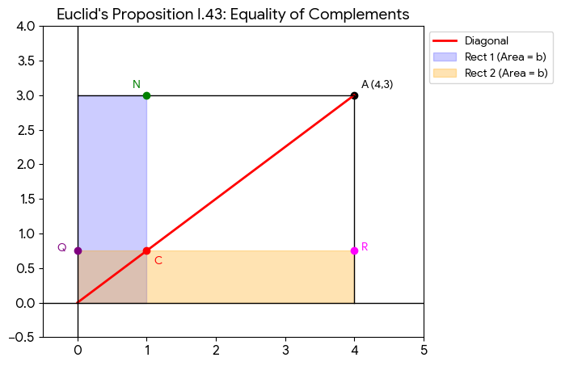

# Addendum

## Cross Checking Techniques

The ability to cross-check answers becomes critical in the study of many science subjects in general. And especially in mathematics where there is usually only 1 right answer, starting with the study of algebra. As such, early algebra students must be introduced to the habit of cross-checking results using any strategy teachers, content areas, or test questions may provide for this purpose. Examples of such strategies are:

- counting
- geometry/space reference
- proof by example
- guess-and-check technique
- sense making in natural language
- making use of answer choices as educated guesses
- making use of multiple ways of solving a problem for answer verification.
- It helps to teach each arithmetic operation with both its inverse and repetition counterparts at a point, to add to cross-checking avenues.
- The typical examination format of objective and theory question can include a third category like what some textbooks do, which is providing the desired full or partial answer for a theory question.
- And can also include a fourth category of requiring working (show working) for an objective question, just to force students to cross-check answers.

## Curriculum Design Tips

1. Can introduce the abacus device for addition as precursor to the standard addition procedure.

2. Can modify standard multiplication procedure to be more intuitive by fillng the bottom right hand spaces with zeros, and introducing the '+' sign to indicate the final addition.

2. Note that each variant of the multiplication procedure for whole numbers is an application of the distributive property of multiplication over addition.

3. Can modify standard long division procedure to be easier to recall, by placing a digit on top of each digit of the dividend. In the case of long division beyond the decimal places available in the dividend, manually add a zero (preceded by adding  a decimal point if necessary) to the dividend, for each digit in the partial quotient answer generated after the decimal point. Overall, this means that the modification is meant to ensure a one-to-one correspondence between the digits and optional decimal point of the dividend, and the digits and optional decimal point of the quotient answer above it.

4. If misconceptions about commutativity of the four basic arithmetic operations prove too enduring to be rooted out by proficiency in arithmetic of non-whole numbers alone, then these exercises may be employed in experiments to try forestalling the misconceptions:
   - asking subtraction questions in which result can be negative, and accepting "undefined", "unexpected number", "negative",
    or actual negative result as valid answers, to show that subtraction is not commutative even before teaching integer arithmetic.
   - asking division questions in which there is division by zero and division which yields zero, and accepting "undefined" as possible result.
   - asking division questions in which quotient can be zero, to show that division is not commutative before teaching fractions.
   - exposing students to calculations involving number zero in operands or answers, before and after teaching integers and fractions.

6. Leverage simplification of fractions for several benefits, including getting students to notice structures related to multiplication,
   division, factors, multiples, and divisors.
   - Students can see pictorially what simplification of fractions is.
   - Serves as counterpart to simplification of algebraic expressions in the future.

7. Curricular activities for applying mathematics in the real world.

   - use ruler and compass only to perform rational number arithmetic, through 2D vector addition, flipping and scaling with right-angled triangles.
   - susu-box (aka piggy bank) management
   - cash-based accounting
   - sports league standings
   - cooking recipes
   - interpreting pharmacists' instructions on frequency of taking pills and syrups, as an application of multiplication.
   - distance measurement, including anatomy-based (inch/thumb, foot, yard/arm span)
   - weight/mass measurement, including balances/scales used throughout history.
   - wall clock readings
   - descriptive statistics
   - sharing money in ratios (determining whether I received correct amount).
   - picking largest of large whole numbers or fractions, representing monetary amounts or physical quantities
   - integer division from partition perspective - sharing money without bias for any recipient (hence a common quotient) or cheating by distributor (hence remainder must be smaller than divisor).

8. Ways of adopting textbook "forward-only" exercises for early algebra.

   - Can adapt for generalization by re-asking the question with large whole numbers, non-whole numbers and unknown numbers.
   - Can adapt for equation solving by "reversing the question".

9. Introduce enough variety of arithmetic expression evaluation exercises in order to avoid using BODMAS mnemonic in unintended situations. Note also that they end up demonstrating associativity of addition and multiplication.

10. HCF and LCM do not seem to be used directly in practice; instead common factors (CF) and common multiples (CM) are used.

11. Quadratic factorization
    - instead of looking for factors of ac which add up to b, can rather teach almighty formula and use product of roots by -a as the desired factors.
    - as a help to quadratic factorization in algebra, can train students to identify coefficients of linear and quadratic expressions and equations in early algebra.

## Explanation for Arithmetic Operations

Those that can do without Euclidean geometry:

- Counting numbers and the operations of addition, subtraction, absolute difference, multiplication, floor division and modulo - counting forward, grid cell counting, repeated subtraction.
- Positive real numbers and the operation of floor division and modulo - repeated subtraction just like for counting numbers.
- Integers and generally real numbers, and the operations of addition and comparison - accounting

Those that need Euclidean geometry:

- Subtraction in general, especially those involving negative operands or capable of producing negative results - 1D Euclidean geometry, aka number line.
- Positive rational numbers and the operation of multiplication - computing areas, need for 2D plane and interpretation of numbers as ratios, linear scaling, compounding ratios. 
- Positive rational numbers and the operation of division - just like multiplication except that ratio is interpreted inversely.
- Positive real numbers and the operations of multiplication and division - Cartesian plane, first quadrant can be used to demonstrate equivalence of linear scaling and area computation.

- Real numbers and the operations of addition, subtraction, multiplication and division, especially those involving irrational or negative operands - 2D Euclidean geometry

## Other Matters

Ways to teach addition
- addition by count all
- addition by count forward
- addition procedure for large counting numbers

Ways to teach subtraction
- subtraction by count all of remainder
- subtraction by count forward (most important of manual procedures)
- subtraction by count backward (mentioned for completeness sake)
- subtraction procedure for large counting numbers

Application of accounting using Chinese rods, black for positive, red for negative.
- addition - meaning
- comparison - meaning
- 'sign' function applied to subtraction operands: 0, '+' or '-' , with meaning based comparison
- zero expressions: b - b = 0; -b + b = 0; b + -b = 0
- negation operation
- subtraction as addition with negation - operational

Application of Euclidean geometry in 1D using number line
- addition - alternative meaning
- absolute difference - meaning
- subtraction - meaning
- subtraction explained with 'abs' and 'sign' functions - alternative meaning

Ways to teach multiplication
- multiplication with counting number operand as equivalent to repeated addition
  - multiplication with single digit counting numbers (less than 10) by filling grid and counting all cells
  - multiplication with single digit counting numbers by table lookup
  - multiplication with one operand being a small single digit counting numbers (5 or less) by repeated addition
  - multiplication procedure with only one single digit counting number
  - multiplication procedure with no single digit counting numbers
  - multiplication with single digit counting numbers by memory recall
- multiplication without counting numbers operand as equivalent to ratio duplication (aka scaling) in 2D Euclidean geometry

Ways to teach division
- division in which both numbers are counting numbers
  - continuum versus discrete distinction in reality, and the resulting difference in 
  - division which results in integer quotient and possible remainder through repeated subtraction
    - division as chunking, like creating stick bundles
    - division as partition, like 50-50 sharing
  - division which results in fraction quotient and no remainder
- division in which one number is not a counting number, as equivalent to ratio creation in 2D Euclidean geometry

NB:
- beware of dependency of arithmetic procedures for counting numbers, on arithmetic of zero
- beware also of dependency of multiplication and division procedures of counting numbers, on arithmetic of 1 as the multiplier and divisor respectively.

Ways to teach decimal number procedures:

- multiplication of decimals - ignore decimals, perform whole number multiplication, and shift decimal point in answer by combined number of decimal places in operands
- division of decimals - ensure there are no decimals in divisor, by multiplying both dividend and divisor by power of ten determined by number of decimal places in divisor; then go ahead and do the division even if the modified dividend still has decimal places in it.

# Notable References
   
   1. https://www.myjoyonline.com/why-parents-cant-do-maths-today/
   2. Maths for Mums and Dads by Rob Eastaway & Mike Askew is published by Square Peg.
   2. More Maths for Mums and Dads by Rob Eastaway & Mike Askew is published by Square Peg.
   3. https://webarchive.nationalarchives.gov.uk/ukgwa/20100607215842/http://www.standards.dfes.gov.uk/schemes3/subjects/?view=get
   4. https://archive.nytimes.com/opinionator.blogs.nytimes.com/2011/04/18/a-better-way-to-teach-math/
   5. https://jumpmath.org/ca/
   6. https://profuturo.education/en/observatory/innovative-solutions/jump-math-teaching-mathematics-in-a-different-way/
   11. https://en.wikipedia.org/wiki/Hans_Freudenthal
   12. https://www.transum.org
   13. https://www.youtube.com/@MathwithMrJ
   14. https://math.stackexchange.com/questions/4510854/geometrical-physical-interpretation-of-multiplication-of-real-numbers-including/4510871#4510871
   15. Euclid’s Elements - http://aleph0.clarku.edu/~djoyce/elements/elements.html
