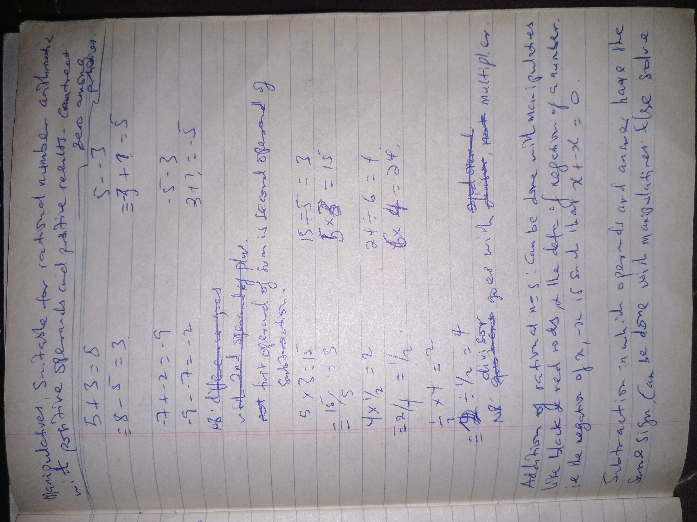
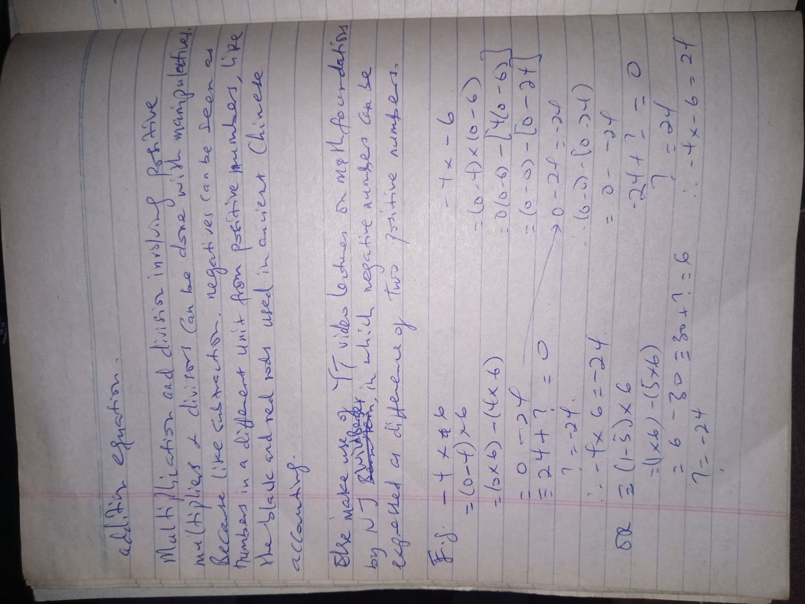
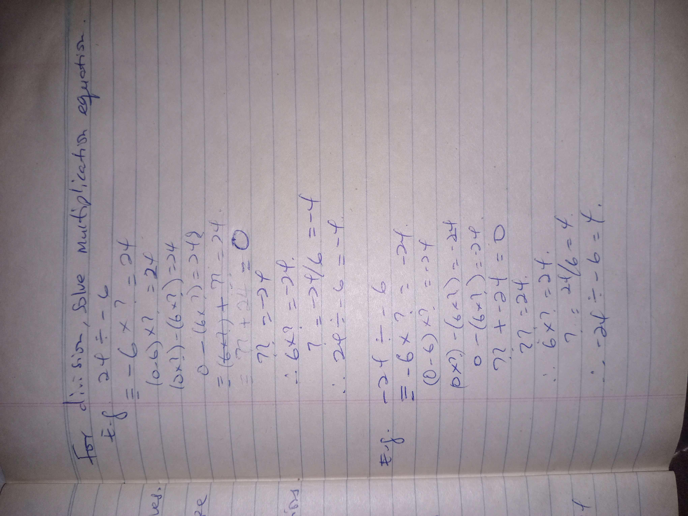

# Addendum

## Cross Checking Techniques

The ability to cross-check answers becomes critical in the study of many science subjects in general. And especially in mathematics where there is usually only 1 right answer, starting with the study of algebra. As such, early algebra students must be introduced to the habit of cross-checking results using any strategy teachers, content areas, or test questions may provide for this purpose. Examples of such strategies are:

- counting
- geometry/space reference
- proof by example
- guess-and-check technique
- sense making in natural language
- making use of answer choices as educated guesses
- making use of multiple ways of solving a problem for answer verification.
- It helps to teach each arithmetic operation with both its inverse and repetition counterparts at a point, to add to cross-checking avenues.
- The typical examination format of objective and theory question can include a third category like what some textbooks do, which is providing the desired full or partial answer for a theory question.
- And can also include a fourth category of requiring working (show working) for an objective question, just to force students to cross-check answers.

## Curriculum Design Tips

1. Can introduce the abacus device for addition as precursor to the standard addition procedure.

2. Can emulate Singapore math curriculum, in which Grades 1-3 are taught wholly with manipulatives.
   - Can even extend manipulatives to negative numbers for addition operation by using red and black rods like was used in ancient Chinese accounting.

2. Can modify standard multiplication procedure to be more intuitive by fillng the bottom right hand spaces with zeros, and introducing the '+' sign to indicate the final addition.

2. Note that each variant of the multiplication procedure for whole numbers is an application of the distributive property of multiplication over addition.

3. Can modify standard long division procedure to be easier to recall, by placing a digit on top of each digit of the dividend. In the case of long division beyond the decimal places available in the dividend, manually add a zero (preceded by adding  a decimal point if necessary) to the dividend, for each digit in the partial quotient answer generated after the decimal point. Overall, this means that the modification is meant to ensure a one-to-one correspondence between the digits and optional decimal point of the dividend, and the digits and optional decimal point of the quotient answer above it.

4. If misconceptions about commutativity of the four basic arithmetic operations prove too enduring to be rooted out by proficiency in arithmetic of non-whole numbers alone, then these exercises may be employed in experiments to try forestalling the misconceptions:
   - asking subtraction questions in which result can be negative, and accepting "undefined", "unexpected number", "negative",
    or actual negative result as valid answers, to show that subtraction is not commutative even before teaching integer arithmetic.
   - asking division questions in which there is division by zero and division which yields zero, and accepting "undefined" as possible result.
   - asking division questions in which quotient can be zero, to show that division is not commutative before teaching fractions.
   - exposing students to calculations involving number zero in operands or answers, before and after teaching integers and fractions.

6. Leverage simplification of fractions for several benefits, including getting students to notice structures related to multiplication,
   division, factors, multiples, and divisors.
   - Students can see pictorially what simplification of fractions is.
   - Serves as counterpart to simplification of algebraic expressions in the future.

7. Curricular activities for applying mathematics in the real world.

   - use ruler and compass only to perform rational number arithmetic, through 2D vector addition, flipping and scaling with right-angled triangles.
   - susu-box (aka piggy bank) management
   - cash-based accounting
   - sports league standings
   - cooking recipes
   - interpreting pharmacists' instructions on frequency of taking pills and syrups, as an application of multiplication.
   - distance measurement, including anatomy-based (inch/thumb, foot, yard/arm span)
   - weight/mass measurement, including balances/scales used throughout history.
   - wall clock readings
   - descriptive statistics
   - sharing money in ratios (determining whether I received correct amount).
   - picking largest of large whole numbers or fractions, representing monetary amounts or physical quantities
   - integer division from sharing perspective - sharing money without bias for any recipient (hence a common quotient) or cheating by distributor (hence remainder must be smaller than divisor).

8. Ways of adopting textbook "forward-only" exercises for early algebra.

   - Can adapt for generalization by re-asking the question with large whole numbers, non-whole numbers and unknown numbers.
   - Can adapt for equation solving by "reversing the question".

9. Introduce enough variety of arithmetic expression evaluation exercises in order to avoid using BODMAS mnemonic in unintended situations. Note also that they end up demonstrating associativity of addition and multiplication.

10. HCF and LCM do not seem to be used directly in practice; instead common factors (CF) and common multiples (CM) are used.

11. Quadratic factorization
    - instead of looking for factors of ac which add up to b, can rather teach almighty formula and use product of roots by -a as the desired factors.
    - as a help to quadratic factorization in algebra, can train students to identify coefficients of linear and quadratic expressions and equations in early algebra.

12. Can introduce negatives this way: 3-4=?, ?+4=3. better yet, 4+?=3,?=3-4,2-3,1-2,0-1 with 0-1 as canonical form.

## Use of Manipulatives

NB: 
   - can put negative numberes in brackets initially. Like 24 &div; (-6)
   - there are two valid ways of converting between addition and subtraction. E.g. 2 + 3 = 5 can be converted to 5 &minus; 2 = 3 or 5 &minus; 3 = 2; similarly 5 &minus; 2 = 3 can be converted to 2 + 3 = 5 or 3 + 2 = 5.
   - and also there are two valid ways of converting between multiplication and division. E.g. 2 &times; 3 = 6 can be converted to 6 &div; 2 = 3 or 6 &div; 3 = 2; similarly 6 &div; 2 = 3 can be converted to 2 &times; 3 = 6 or 3 &times; 2 = 6.

## Geometric Interpretation of Arithmetic Operations

There is an interesting reading here about how irrational numbers used to be based on Euclidean geometry: http://aleph0.clarku.edu/~djoyce/elements/bookVI/propVI1.html

- Positive rational numbers and multiplication - computing areas by grid cell counting, and dividing the grid cell count by the grid cell count in the unit square (may have to extend the grid to get at least one unit square if one of the operands is a proper fraction). See https://math.stackexchange.com/a/892282.

- Geometry-based real numbers and the operations of addition and subtraction, especially those involving subtraction from negative operands - number line.
   - addition
   - comparison
   - negation operation
   - 'sign' function applied to subtraction operands: 0, '+' or '-' , based on comparison
   - absolute function 'abs' applied to subtraction operands
   - subtraction explained with 'abs' and 'sign' functions
- Positive part of Geometry-based real numbers and the operations of multiplication and division - First quadrant of Cartesian plane can be used to demonstrate equivalence of linear scaling and area computation.
- Geometry-based real numbers and the operations of multiplication and division - All four quadrants of Cartesian plane.

## Other Matters

Ways to teach addition
- addition by count afresh
- addition by count forward (most important of manual procedures)
- addition procedure for large counting numbers

Ways to teach subtraction
- subtraction by count leftover
- subtraction by count forward (most important of manual procedures)
- subtraction by count backward (mentioned for completeness sake)
- subtraction procedure for large counting numbers

Ways to teach multiplication
- multiplication with single digit counting numbers (less than 5) by filling grid and counting all cells, or by using fingers and toes.
- multiplication with single digit counting numbers by memory recall
   - leverage patterns in time tables for 5, 9, 10 and 11.
   - leverage commutativity of multiplication for half of time tables for 6, 7 and 8.
   - that leaves only the following five for individual memorization: 6 &times; 7 = 42, 6 &times; 8 = 48, 7 &times; 7 = 49, 7 &times; 8 = 56, and 8 &times; 8 = 64.
   - NB: 12 times table may be omitted from memorization.
- multiplication procedure with only one single digit counting number
- multiplication procedure with no single digit counting numbers

Ways to teach decimal number procedures:

- multiplication of decimals - ignore decimals, perform whole number multiplication, and shift decimal point in answer by combined number of decimal places in operands
- division of decimals - ensure there are no decimals in divisor, by multiplying both dividend and divisor by power of ten determined by number of decimal places in divisor; then go ahead and do the division even if the modified dividend still has decimal places in it.

Ways of explaining multiplication
- multiplication with whole number multiplier as repeated addition of the whole of the multiplicand. In this sense division as sharing remains a follow up to multiplication as its inverse.
- multiplication with fraction multiplier as repeated addition of a resizing/scaling of the multiplicand by the denominator of the multiplier. In this sense it seems more beneficial to view  division as containment as occuring first, and multiplication following it as its inverse.

Ways of explaining division 
- division which results in integer quotient and possible remainder
- division which results in fraction quotient and no remainder
- division interpretation as sharing. Note that this interpreation requires divisor to be whole number, and hence corresponds with repeated-addition-of-a-whole interpretation of multiplication in which divisor is the multiplier.
- division as containment. Note that this interpretation is applicable even if divisor is a fraction, and hence corresponds with repeated-addition-of-a-resizing interpretation of multiplication in which the quotient is the multiplier.

NB:
- beware that zero appears first in history not for the purpose of closing subtraction
for case of equal operands, but rather as a necessity of a compact positional number representation system. As such zero should also be introduced first to learners in
context of positional number system before it is used in arithmetic.
- beware of dependency of arithmetic procedures for counting numbers, on arithmetic of zero.
- beware also of dependency of multiplication and division procedures of counting numbers, on arithmetic of 1 as the multiplier and divisor respectively.
- beware that it is unit fraction usage and "of" operator existed long before they became the basis for defining multiplication and division of fractions.
   - unit fractions and the "of" operator seem to be as innate to humanity as counting numbers and the four arithmetic operations on counting numbers.
   - a/b is the modern compact expression for the concept of a general non-unit fraction, which was developed later than unit fractions. A fraction was defined as *a* copies of unit fraction 1/b. With this concept, *b* copies of 1/b gives 1, and generally *b* copies of a/b gives a.
   - the concept of fraction included this understanding: a/b is equivalent to (a &times; e)/(b &times; e), b &ne; 0, where *a* and *b* are whole numbers, and *e* is *anything representing a unit piece*. This meant *e* can be an abstract object like a whole number or rectangle, but can also be a concrete object like a stick or a coin. And *e* doesn't have to be one object, it can be any whole number of objects. So fraction with numerator a and denominator b (
      represented as a/b in modern math) really meant *a* times of 1/b of some unspecified unit piece.
   - a/b of c/d, b, d &ne; 0, where a, b, c and d are whole numbers, and where b divides c, is the modern compact expression for the ancient operation of (a &times; (c &div; b)) / d. Where b does not divide c, an equivalent fraction was found for second operand which will overcome that obstacle.
- beware that the meaning of division of fractions depends on history.
   - a &div; b, b &ne; 0, where a and b are whole numbers, and where b does not divide a, was defined as equal to that pre-existing quantity fraction, which we now denote as a/b, because adding a/b *b* number of times indeed gives *a*.
   - because a &div; b is defined as a fraction, it inherits the fraction property
   that (a &times; e) &div; (b &times; e) equals a &div; b. Since *e* can be anything representing a unit piece, *e* was understood to include fractions.
   - meanwhile, the general division problem which is a/b &div; c/d, b, d &ne; 0, and where a, b, c and d are whole numbers, continued to be treated as repeated subtraction, but created the need to simplify the complex fraction created when the repeated subtraction does not yield a remainder of zero.
   - It will later become manifest to mathematicians, that the solution to the simplification problem becomes obvious if the numerator (a fraction) and the denominator (also a fraction) have the same denominators. Because they treated non-unit fractions as integral copies of unit fractions, it was obvious to them that the reciprocal of the common denominator was acting as a unit piece.
   - So (a/e) &div; (b/e) becomes (*a* copies of 1/e) &div; (*b* copies of 1/e) = a &div; b = a/b.
- beware that the meaning of multiplication by a fraction multiplier also depends on history.
   - multiplication by a fraction multiplier is really quasi multiplication by a fraction multiplier using the "of" operator.
   - multiplication is repeated addition for counting number multiplier, or inverse of division as containment for both counting number multiplier and fraction multiplier.
   - a story which explains the origin of this meaning is as follows:
   - addition, subtraction, "of" operator and the division operation were known for fraction operands, but not multiplication. Also fractions were not seen as peers of counting numbers.
   - then the Indian mathematician Brahmagupta in the 7th century AD decided to write fraction in compact expression instead of rhetorically, in which fraction were
   written in a vertical column with numerator on top and denominator at the bottom. He didn't add the horizontal bar, which was added by mathematicians much later.
   - then he realised that the "of" operator has the following shortcut: (a &times; c)/(b &times; d)
   - furthermore he realised that if b = d = 1, the shortcut becomes the multiplication expression for counting numbers.
   - consequently, later mathematicians will treat fractions are peers of counting numbers, and put fractions and counting numbers together under a unified category (called positive rational numbers today), which is a quotient of two counting numbers, and in which counting numbers are seen as fraction with a denominator of 1.
   - the definition of the unified category was concluded when mathematicians began treating the "of" operator as "quasi multiplication" of for the new category, to serve as counterpart of multiplication of counting numbers.
   - over time the "of" operator itself faded into the background and the quasi multiplication operation it gave birth to took its place at the foreground. The operation became unqualified multiplication, in which multiplication was now defined as repeated addition for counting number multiplier, or inverse of division (as containment rather than as sharing) for both counting number multiplier and fraction multiplier.

# Notable References
   
   1. https://www.myjoyonline.com/why-parents-cant-do-maths-today/
   3. https://webarchive.nationalarchives.gov.uk/ukgwa/20100607215842/http://www.standards.dfes.gov.uk/schemes3/subjects/?view=get
   4. https://archive.nytimes.com/opinionator.blogs.nytimes.com/2011/04/18/a-better-way-to-teach-math/
   5. https://jumpmath.org/ca/
   6. https://profuturo.education/en/observatory/innovative-solutions/jump-math-teaching-mathematics-in-a-different-way/
   11. https://en.wikipedia.org/wiki/Hans_Freudenthal
   12. https://www.transum.org
   13. https://www.youtube.com/@MathwithMrJ
   14. Explaining multiplication of fractions - https://math.stackexchange.com/a/891713, https://math.stackexchange.com/a/892282
   15. geometrical/physical interpretation of multiplication of real numbers (including negative) - https://math.stackexchange.com/questions/4510854/geometrical-physical-interpretation-of-multiplication-of-real-numbers-including/4510871#4510871
   16. Euclid’s Elements - http://aleph0.clarku.edu/~djoyce/elements/elements.html
   17. https://www.youtube.com/@njwildberger
   18. Arithmetic for parents by Ron Aharoni
   
